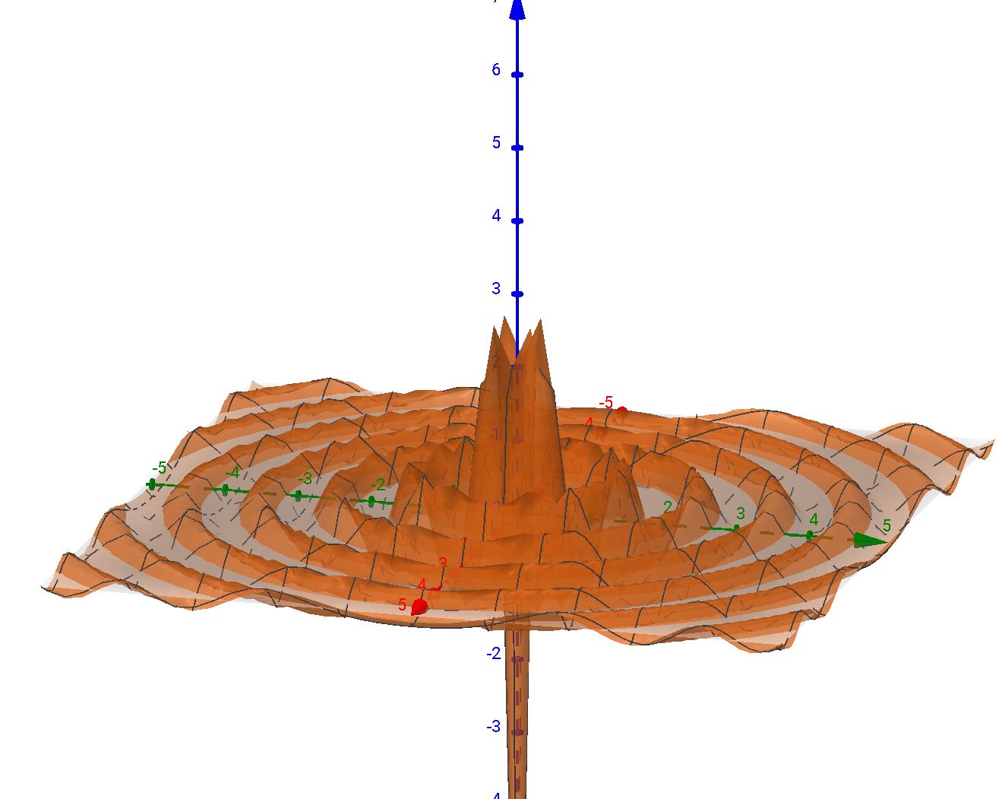

# EWV
Electromagnetic wave visualization using Apple ARKit

## Still in development

# Goal of the app
The goal is to create an app which shows the "way" of an electromagnetic wave (especially microwaves).

It should look similar to this simulation in GeoGebra:

Animated:

